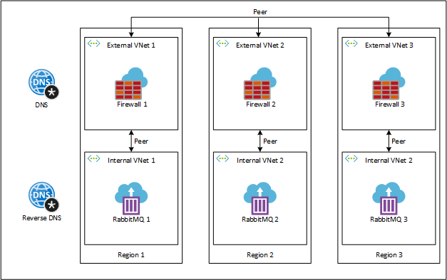

Pulumi, an open source cloud development platform that supports multiple languages and platforms, allows programming and managing cloud environments using a consistent model and the power of full programing languages.

One of those supported languages is C#, which we will be using to deploy a geo-redundant serverless cluster of the well-known messaging solution RabbitMQ. To run the cluster, we will be using three regions, in which we will be deploying:

-   Two peered virtual networks, one internal for the containers, and one external for connecting to the other regions. Two networks are required because (at least at the writing of this article) Azure Container Instances only support one peered network, so to overcome that, we will be peering the network with the containers with an additional network in the region, which in turn, connects with the external networks from the other regions.
-   A RabbitMQ node using Azure Container Instances that will be deployed in the internal virtual network.
-   An Azure Firewall, which will be deployed in the external virtual network, acting as a network virtual appliance (NVA) with rules for forwarding traffic between the internal node and the other regions.
-   Route tables with routes that will enable the inter-network transfer of data.
-   A storage account with file shares for maintaining the node’s state.

Additionally, as we will be using RabbitMQ’s DNS based cluster peer discovery mechanism, we will also be deploying at the global level:

-   DNS zone for the node’s A records and the discovery record required by RabbitMQ.
-   A reverse DNS zone for the PTR records of the nodes required by RabbitMQ.



*Geo-redundant serverless RabbitMQ cluster*

### Prerequisites

As we will be using Pulumi for .NET to deploy to Azure, we will need the following installed on our workstation:

-   Azure CLI: installation guide is available [here](https://docs.microsoft.com/en-us/cli/azure/install-azure-cli?view=azure-cli-latest).
-   .NET Core SDK: download is available [here](https://dotnet.microsoft.com/download).
-   Pulumi: installation guide is available [here](https://www.pulumi.com/docs/get-started/install/).

### Example Repository

The complete example of deploying the RabbitMQ cluster can be downloaded or cloned for the following GitHub repository:

> [**GitHub - ItayPodhajcer/pulumi-rabbitmq-azure**](https://github.com/ItayPodhajcer/pulumi-rabbitmq-azure)
> 
> Contribute to ItayPodhajcer/pulumi-rabbitmq-azure development by creating an account on GitHub.

When running `pulumi up` you will be asked to create a stack (you can use whatever you here like `Example`) and set a passphrase (you can leave it empty and press `enter` as there are no stored secrets in this stack).

### Setup the Project

After all the required tools are installed, we can start by creating the empty Pulumi project running `pulumi new azure-csharp` inside an empty folder. Set a name for the project (like `Example`), a description (like `RabbitMQ Serverless Cluster`), a stack name (like `Example`), a passphrase (you can use an empty one and just press `enter` as we won’t be storing secrets in the stack) and an Azure location (just use the default).

Now that we have an initial project, we will also add the `Pulumi.Random` package to the project by running the command `dotnet add package Pulumi.Random`, as we will be using it to generate the cluster sec, And rename the `MyStack` class and file to `EampleStack` (it also needs to be changed inside `Program.cs` which holds the code that triggers the deployment of the stack).

Lastly, we call `dotnet restore` to also download the `PUlumi.Azure` package that was included in the project when it was created.

### Writing the Stack

We will start by defining a few constants, the constructor, an empty method called `Stack()`, which will be called by the constructor to start creating the resources and a property named `Cookie`, which will hold the cluster’s secret, decorated with the `Output` attribute to let Pulumi know that the value needs to be printed out once the deployment is complete:

```csharp
class ExampleStack : Stack
{
    private const string DeploymentName = "rabbitmq";
    private const string RabbitNodeName = "rabbit";
    private const string ZoneName = "example.com";
    private const string ReverseZoneName = "10.in-addr.arpa";
    private const string DiscoveryRecordName = "discovery";
    private const string ConfigShareName = "config";
    private const string MnesiaShareName = "mnesia";
    private const string SchemaShareName = "schema";
    private const int ContainerStartupDelay = 60;

    private readonly string[] locations = { "centralus", "eastus", "westus" };

    public ExampleStack()
    {
        Stack();
    }

    [Output]
    public Output<string> Cookie { get; private set; } = Output.Create(string.Empty);

    private void Stack()
    {
      // ...
    }
    
    // ...
}
```

Now that we have our initial class, we can start writing methods for the resources we will be creating:

-   Resource groups:

```csharp
private ResourceGroup ResourceGroup(string name, string location)
{        
    var resourceGroup = new ResourceGroup(name, new ResourceGroupArgs
    {
        Location = location
    });

    return resourceGroup;
}
```

-   Private DNS zone:

```csharp
private Zone PrivateDns(Output<string> resourceGroupName)
{
    var zone = new Zone(ZoneName, new ZoneArgs
    {
        Name = ZoneName,
        ResourceGroupName = resourceGroupName
    });

    return zone;
}
```

-   Private reverse DNS zone:

```csharp
private Zone PrivateReverseDns(Output<string> resourceGroupName)
{
    var zone = new Zone(ReverseZoneName, new ZoneArgs
    {
        Name = ReverseZoneName,
        ResourceGroupName = resourceGroupName
    });

    return zone;
}
```

-   Random string for the RabbitMQ cluster secret:

```csharp
private RandomString RabbitCookie()
{
    var rabbitCookie = new RandomString("rabbit-cookie", new RandomStringArgs
    {
        Length = 20,
        Special = false,
        Lower = false,
        Number = false,
        Upper = true
    });

    return rabbitCookie;
}
```

-   DNS zone links:

```csharp
private void ZoneLink(Output<string> resourceGroupName, Zone privateDns, Output<string> inVNetId, int vnetRangePrefix, bool isReverse)
{
    var prefix = isReverse ? "rdns" : "dns";
    var zoneLink = new ZoneVirtualNetworkLink($"{prefix}-link-{vnetRangePrefix / 2 + 1}", new ZoneVirtualNetworkLinkArgs
    {
        ResourceGroupName = resourceGroupName,
        PrivateDnsZoneName = privateDns.Name,
        VirtualNetworkId = inVNetId,
        RegistrationEnabled = false
    });
}
```

-   RabbitMQ node container:

```csharp
private Group Container(ResourceGroup resourceGroup, Account storage, Output<string> networkProfileId, int vnetRangePrefix, RandomString rabbitCookie, Resource[] dependencies)
{
    var containerGroup = new Group($"aci-{DeploymentName}-{vnetRangePrefix / 2 + 1}", new GroupArgs
    {
        ResourceGroupName = resourceGroup.Name,
        Location = resourceGroup.Location,
        IpAddressType = "Private",
        NetworkProfileId = networkProfileId,
        OsType = "Linux",
        Containers =
        {
            new GroupContainerArgs
            {
                Name = "rabbitmq",
                Image = "rabbitmq",
                Commands = { "/bin/bash", "-c", $"(sleep {ContainerStartupDelay} && docker-entrypoint.sh rabbitmq-server) & wait" },
                Cpu = 1,
                Memory = 1.5,
                Volumes =
                {
                    ContainerVolume(storage, vnetRangePrefix, ConfigShareName, "/var/lib/rabbitmq/config"),
                    ContainerVolume(storage, vnetRangePrefix, MnesiaShareName, "/var/lib/rabbitmq/mnesia"),
                    ContainerVolume(storage, vnetRangePrefix, SchemaShareName, "/var/lib/rabbitmq/schema"),
                },
                Ports =
                {
                    ContainerPort(15672, "TCP"),
                    ContainerPort(25672, "TCP"),
                    ContainerPort(5672, "TCP"),
                    ContainerPort(4369, "TCP")
                },
                EnvironmentVariables =
                {
                    { "RABBITMQ_ERLANG_COOKIE", rabbitCookie.Result },
                    { "RABBITMQ_SERVER_ADDITIONAL_ERL_ARGS", $"-rabbit cluster_formation [{{peer_discovery_backend,rabbit_peer_discovery_dns}},{{peer_discovery_dns,[{{hostname,\"{DiscoveryRecordName}.{ZoneName}\"}}]}}]" },
                    { "RABBITMQ_NODENAME", $"{RabbitNodeName}@{DeploymentName}{vnetRangePrefix / 2 + 1}.{ZoneName}" },
                    { "RABBITMQ_USE_LONGNAME", "true" }
                }
            }
        }
    },
    new CustomResourceOptions 
    {
        DependsOn = dependencies
    });

    return containerGroup;
}
```

Note that we are overriding RabbitMQ docker image’s default command with `{ “/bin/bash”, “-c”, $”(sleep {ContainerStartupDelay} && docker-entrypoint.sh rabbitmq-server) & wait” }` to delay the startup of the container, but still keep it responsive. More on this later.

-   Container mounted volumes:

```csharp
private GroupContainerVolumeArgs ContainerVolume(Account storageAccount, int vnetRangePrefix, string shareName, string mountPath)
{
    var containerVolume = new GroupContainerVolumeArgs
    {
        Name = $"vol-{DeploymentName}-{shareName}-{vnetRangePrefix / 2 + 1}",
        MountPath = mountPath,
        StorageAccountName = storageAccount.Name,
        StorageAccountKey = storageAccount.PrimaryAccessKey,
        ShareName = FileShare(storageAccount, $"{shareName}{vnetRangePrefix / 2 + 1}").Name
    };

    return containerVolume;
}
```

-   Storage accounts:

```csharp
private Account Storage(ResourceGroup resourceGroup, int vnetRangePrefix)
{
    var storageAccount = new Account($"strg{DeploymentName}{vnetRangePrefix / 2 + 1}", new AccountArgs
    {
        ResourceGroupName = resourceGroup.Name,
        Location = resourceGroup.Location,
        AccountKind = "StorageV2",
        AccountReplicationType = "LRS",
        AccountTier = "Standard"
    });

    return storageAccount;
}
```

-   File shares:

```csharp
private Share FileShare(Account storageAccount, string shareName)
{
    var fileShare = new Share(shareName, new ShareArgs
    {
        StorageAccountName = storageAccount.Name
    });

    return fileShare;
}
```

-   Container ports:

```csharp
private GroupContainerPortArgs ContainerPort(int port, string protocol)
{
    var containerPort = new GroupContainerPortArgs
    {
        Port = port,
        Protocol = protocol
    };

    return containerPort;
}
```

-   Virtual networks

```csharp
private VirtualNetwork VNet(ResourceGroup resourceGroup, int vnetRangePrefix, bool isExternal)
{
    var vnetType = "in";

    if (isExternal)
    {
        vnetType = "ex";
        vnetRangePrefix++;
    }

    var vnet = new VirtualNetwork($"vnet-{DeploymentName}-{vnetType}-{vnetRangePrefix / 2 + 1}", new VirtualNetworkArgs
    {
        ResourceGroupName = resourceGroup.Name,
        AddressSpaces = { $"10.{vnetRangePrefix}.0.0/16" },
    });

    return vnet;
}
```

-   Internal virtual network subnets:

```csharp
private Subnet InSNet(ResourceGroup resourceGroup, int vnetRangePrefix, VirtualNetwork inVNet)
{
    var inSNet = new Subnet($"snet-{DeploymentName}-in-{vnetRangePrefix / 2 + 1}", new SubnetArgs
    {
        ResourceGroupName = resourceGroup.Name,
        VirtualNetworkName = inVNet.Name,
        AddressPrefixes = $"10.{vnetRangePrefix}.0.0/16",
        ServiceEndpoints = { "Microsoft.Storage" },
        Delegations = {
                new SubnetDelegationArgs(){
                    Name = $"snet-delegation-{DeploymentName}-{vnetRangePrefix / 2 + 1}",
                    ServiceDelegation = new SubnetDelegationServiceDelegationArgs
                    {
                        Name = "Microsoft.ContainerInstance/containerGroups"
                    }
                }
            }
    });

    return inSNet;
}
```

Note that we are creating it with the `Microsoft.Storage` service endpoint to allow access to storage accounts and the `Microsoft.ContainerInstance/containerGroups` delegation, which is required for deploying containers into virtual networks.

-   Network profiles, also required for deploying containers into virtual networks:

```csharp
private Profile NetworkProfile(ResourceGroup resourceGroup, int vnetRangePrefix, Subnet inSNet)
{
    var networkProfile = new Profile($"np-{DeploymentName}-{vnetRangePrefix / 2 + 1}", new ProfileArgs
    {
        Location = resourceGroup.Location,
        ResourceGroupName = resourceGroup.Name,
        ContainerNetworkInterface = new ProfileContainerNetworkInterfaceArgs
        {
            Name = $"nic-{DeploymentName}-{vnetRangePrefix / 2 + 1}",
            IpConfigurations =
            {
                new ProfileContainerNetworkInterfaceIpConfigurationArgs 
                {
                    Name = $"ipconfig-{DeploymentName}-{vnetRangePrefix / 2 + 1}",
                    SubnetId = inSNet.Id
                }
            }
        }
    });

    return networkProfile;
}
```

-   External virtual network subnets:

```csharp
private Subnet ExSNet(ResourceGroup resourceGroup, int vnetRangePrefix, VirtualNetwork exVNet)
{
    var exSNet = new Subnet($"snet-{DeploymentName}-ex-{vnetRangePrefix / 2 + 1}", new SubnetArgs
    {
        Name = "AzureFirewallSubnet",
        ResourceGroupName = resourceGroup.Name,
        VirtualNetworkName = exVNet.Name,
        AddressPrefixes = $"10.{vnetRangePrefix + 1}.0.0/16",
    });

    return exSNet;
}
```

-   Internal and external virtual networks peering:

```csharp
private void RegionPeering(Output<string> resourceGroupName, VirtualNetwork inVNet, VirtualNetwork exVNet, int vnetRangePrefix)
{
    var inVNetPeer = new VirtualNetworkPeering($"peer-vnet{vnetRangePrefix / 2 + 1}-in", new VirtualNetworkPeeringArgs
    {
        ResourceGroupName = resourceGroupName,
        VirtualNetworkName = inVNet.Name,
        RemoteVirtualNetworkId = exVNet.Id,
        AllowForwardedTraffic = true
    });

    var exVNetPeer = new VirtualNetworkPeering($"peer-vnet{vnetRangePrefix / 2 + 1}-ex", new VirtualNetworkPeeringArgs
    {
        ResourceGroupName = resourceGroupName,
        VirtualNetworkName = exVNet.Name,
        RemoteVirtualNetworkId = inVNet.Id,
        AllowForwardedTraffic = true
    });
}
```

-   External virtual network firewalls:

```csharp
private Firewall Firewall(ResourceGroup resourceGroup, Subnet snet, int vnetRangePrefix)
{
    var publicIp = new PublicIp($"ip-fw-{DeploymentName}{vnetRangePrefix / 2 + 1}", new PublicIpArgs
    {
        ResourceGroupName = resourceGroup.Name,
        Location = resourceGroup.Location,
        Sku = "Standard",
        AllocationMethod = "Static"
    });

    var firewall = new Firewall($"fw-{DeploymentName}{vnetRangePrefix / 2 + 1}", new FirewallArgs
    {
        ResourceGroupName = resourceGroup.Name,
        Location = resourceGroup.Location,
        IpConfigurations =
        {
            new FirewallIpConfigurationArgs
            {
                Name = $"fw-config-{DeploymentName}{vnetRangePrefix / 2 + 1}",
                SubnetId = snet.Id,
                PublicIpAddressId = publicIp.Id
            }
        }
    });

    return firewall;
}
```

-   Internal and external virtual networks routing:

```csharp
private void RegionRouteTable(ResourceGroup resourceGroup, Subnet snet, int vnetRangePrefix, Firewall firewall)
{
    firewall.IpConfigurations
        .GetAt(0)
        .Apply(config =>
            new RouteTable($"route-{vnetRangePrefix / 2 + 1}-in", new RouteTableArgs
            {
                ResourceGroupName = resourceGroup.Name,
                Location = resourceGroup.Location,
                Routes = Enumerable
                    .Range(1, locations.Count())
                    .Where(prefix => prefix != vnetRangePrefix / 2 + 1)
                    .Select(prefix => new RouteTableRouteArgs
                    {
                        Name = $"route-{vnetRangePrefix / 2 + 1}-to-{prefix}",
                        AddressPrefix = $"10.{prefix * 2 - 1}.0.0/16",
                        NextHopType = "VirtualAppliance",
                        NextHopInIpAddress = config.PrivateIpAddress ?? string.Empty
                    })
                    .ToArray()
            }))
        .Apply(route => 
            new SubnetRouteTableAssociation($"route-assoc-{vnetRangePrefix / 2 + 1}-in", new SubnetRouteTableAssociationArgs
            {
                RouteTableId = route.Id,
                SubnetId = snet.Id
            }));
}
```

-   RabbitMQ nodes DNS records:

```csharp
private void DnsRecord(Output<string> resourceGroupName, Zone privateDns, Output<string> ipAddress, int vnetRangePrefix, Resource[] dependencies)
{
    var nodeRecord = new ARecord($"a-{DeploymentName}{vnetRangePrefix / 2 + 1}", new ARecordArgs
    {
        ResourceGroupName = resourceGroupName,
        ZoneName = privateDns.Name,
        Name = $"{DeploymentName}{vnetRangePrefix / 2 + 1}",
        Records = { ipAddress },
        Ttl = 300
    },
    new CustomResourceOptions
    {
        DependsOn = dependencies
    });
}
```

-   RabbitMQ nodes reverse DNS records:

```csharp
private void ReverseDnsRecord(Output<string> resourceGroupName, Zone privateReverseDns, Output<string> ipAddress, int vnetRangePrefix)
{
    var nodeRecord = new PTRRecord($"ptr-{DeploymentName}{vnetRangePrefix / 2 + 1}", new PTRRecordArgs
    {
        ResourceGroupName = resourceGroupName,
        ZoneName = privateReverseDns.Name,
        Name = ipAddress.Apply(ipAddress => ConstructReveseIpAddress(ipAddress, 3)),
        Records = { $"{DeploymentName}{vnetRangePrefix / 2 + 1}.{ZoneName}" },
        Ttl = 300
    });
}
```

-   Reversing the IP address as required by a reverse PTR record:

```csharp
private string ConstructReveseIpAddress(string ipAddress, int requriedSegments)
{
    var segments = ipAddress
        .Split('.')
        .Reverse()
        .Take(requriedSegments);

    var reverseIp = string.Join('.', segments);

    return reverseIp;
}
```

-   Firewall IP forwarding rules:

```csharp
private IEnumerable<FirewallNetworkRuleCollection> IpForwarding(Output<string>[] ipAddresses, Firewall[] firewalls)
{
    return firewalls
        .Select((firewall, currFirewall) =>
            new FirewallNetworkRuleCollection($"fw-rules-{currFirewall + 1}-in", new FirewallNetworkRuleCollectionArgs
            {
                ResourceGroupName = firewall.ResourceGroupName,
                AzureFirewallName = firewall.Name,
                Action = "Allow",
                Priority = 100,
                Rules = {
                    new FirewallNetworkRuleCollectionRuleArgs {
                        Name = $"rule-from-{currFirewall + 1}-in",
                        SourceAddresses = { ipAddresses[currFirewall] },
                        DestinationAddresses = ipAddresses
                            .Where((ApplicationGatewayBackendAddressPoolArgs, index) => index != currFirewall)
                            .ToList(),
                        Protocols = { "TCP" },
                        DestinationPorts = { "*" }
                    },
                    new FirewallNetworkRuleCollectionRuleArgs {
                        Name = $"rule-to-{currFirewall + 1}-in",
                        SourceAddresses = ipAddresses
                            .Where((ApplicationGatewayBackendAddressPoolArgs, index) => index != currFirewall)
                            .ToList(),
                        DestinationAddresses = { ipAddresses[currFirewall] },
                        Protocols = { "TCP" },
                        DestinationPorts = { "*" }
                    }
                }
            }));
}
```

-   RabbitMQ’s discovery DNS record:

```csharp
private ARecord DiscoveryDnsRecord(Output<string> resourceGroupName, Zone privateDns, Output<string>[] ipAddresses)
{
    var discoveryRecord = new ARecord($"a-{DiscoveryRecordName}", new ARecordArgs
    {
        ResourceGroupName = resourceGroupName,
        ZoneName = privateDns.Name,
        Name = DiscoveryRecordName,
        Records = ipAddresses,
        Ttl = 300
    });

    return discoveryRecord;
}
```

-   Global peering of the external virtual networks:

```csharp
private void GlobalPeering(VirtualNetwork[] vnets)
{
    for (int currVNetEx = 0; currVNetEx < vnets.Length; currVNetEx++)
    {
        for (int currVNetIn = 0; currVNetIn < vnets.Length; currVNetIn++)
        {
            if (vnets[currVNetEx] != vnets[currVNetIn])
            {
                var vnetPeer = new VirtualNetworkPeering($"peer-vnet{currVNetEx + 1}-vnet{currVNetIn + 1}", new VirtualNetworkPeeringArgs
                {
                    ResourceGroupName = vnets[currVNetEx].ResourceGroupName,
                    VirtualNetworkName = vnets[currVNetEx].Name,
                    RemoteVirtualNetworkId = vnets[currVNetIn].Id,
                    AllowForwardedTraffic = true
                });
            }
        }
    }
}
```

-   Global routes for the virtual networks:

```csharp
private void GlobalRoutes(VirtualNetwork[] vnets, Subnet[] snets, Firewall[] firewalls)
{
    for (int currVnet = 0; currVnet < vnets.Length; currVnet++)
    {
        var route = new RouteTable($"route-{currVnet + 1}-ex", new RouteTableArgs
        {
            ResourceGroupName = vnets[currVnet].ResourceGroupName,
            Location = vnets[currVnet].Location,
            Routes = Enumerable
                .Range(0, locations.Count())
                .Where(currFirewall => currFirewall != currVnet)
                .Select(currFirewall => FirewallRoute(firewalls[currFirewall], currVnet, currFirewall))
                .Concat(new[] { InternetRoute(currVnet) })
                .ToArray()
        });

        var association = new SubnetRouteTableAssociation($"route-assoc-{currVnet + 1}-ex", new SubnetRouteTableAssociationArgs
        {
            RouteTableId = route.Id,
            SubnetId = snets[currVnet].Id
        });
    }
}
```

-   Firewall virtual appliance routes:

```csharp
private Output<RouteTableRouteArgs> FirewallRoute(Firewall firewall, int currVnet, int currFirewall)
{
    return firewall.IpConfigurations
        .GetAt(0)
        .Apply(config => new RouteTableRouteArgs
        {
            Name = $"route-{currVnet + 1}-to-fw{currFirewall + 1}",
            AddressPrefix = $"10.{currFirewall * 2 + 1}.0.0/16",
            NextHopType = "VirtualAppliance",
            NextHopInIpAddress = config.PrivateIpAddress ?? string.Empty
        });
}
```

-   Internet outbound routes:

```csharp
private Output<RouteTableRouteArgs> InternetRoute(int currVnet)
{
    return Output
        .Create(new RouteTableRouteArgs
        {
            Name = $"route-{currVnet + 1}-to-internet",
            AddressPrefix = "0.0.0.0/0",
            NextHopType = "Internet"
        });
}
```

Now that we can create all the necessary resources, it is time to put it all together inside the empty `Stack()` method we created earlier:

```csharp
private void Stack()
{
    var vnetRangePrefix = 1;
    VirtualNetwork[] exNetworks = new VirtualNetwork[locations.Count()];
    Subnet[] exSubnets = new Subnet[locations.Count()];
    Output<string>[] ipAddresses = new Output<string>[locations.Count()];
    Firewall[] firewalls = new Firewall[locations.Count()];

    var commonResourceGroup = ResourceGroup($"rg-{DeploymentName}-common-eastus2", "eastus2");
    var privateDns = PrivateDns(commonResourceGroup.Name);
    var privateReverseDns = PrivateReverseDns(commonResourceGroup.Name);
    var rabbitCookie = RabbitCookie();

    foreach (string location in locations)
    {
        var resourceGroup = ResourceGroup($"rg-{DeploymentName}-{location}", location);
        var inVNet = VNet(resourceGroup, vnetRangePrefix, false);
        var inSNet = InSNet(resourceGroup, vnetRangePrefix, inVNet);
        var networkProfile = NetworkProfile(resourceGroup, vnetRangePrefix, inSNet);
        var exVNet = VNet(resourceGroup, vnetRangePrefix, true);
        var exSNet = ExSNet(resourceGroup, vnetRangePrefix, exVNet);
        var firewall = Firewall(resourceGroup, exSNet, vnetRangePrefix);
        var storage = Storage(resourceGroup, vnetRangePrefix);
        var container = Container(resourceGroup, storage, networkProfile.Id, vnetRangePrefix, rabbitCookie, new [] { firewall });

        exNetworks[vnetRangePrefix / 2] = exVNet;
        exSubnets[vnetRangePrefix / 2] = exSNet;
        ipAddresses[vnetRangePrefix / 2] = container.IpAddress;
        firewalls[vnetRangePrefix / 2] = firewall;

        RegionPeering(resourceGroup.Name, inVNet, exVNet, vnetRangePrefix);
        RegionRouteTable(resourceGroup, inSNet, vnetRangePrefix, firewall);
        ZoneLink(commonResourceGroup.Name, privateDns, inVNet.Id, vnetRangePrefix, false);
        ZoneLink(commonResourceGroup.Name, privateReverseDns, inVNet.Id, vnetRangePrefix, true);
        ReverseDnsRecord(commonResourceGroup.Name, privateReverseDns, container.IpAddress, vnetRangePrefix);

        vnetRangePrefix += 2;
    }

    GlobalPeering(exNetworks);
    GlobalRoutes(exNetworks, exSubnets, firewalls);
    var forwardingRules = IpForwarding(ipAddresses, firewalls);
    var record = DiscoveryDnsRecord(commonResourceGroup.Name, privateDns, ipAddresses);
    var dnsDependencies = forwardingRules
        .Cast<Resource>()
        .Concat(new [] { record })
        .ToArray();

    vnetRangePrefix = 1;

    foreach (Output<string> ipAddress in ipAddresses)
    {
        DnsRecord(commonResourceGroup.Name, privateDns, ipAddress, vnetRangePrefix, dnsDependencies);

        vnetRangePrefix += 2;
    }

    Cookie = rabbitCookie.Result;
}
```

Note that we are using two loops to create the required resources. The first one creates most of the resources (storage, firewall, networks, container, etc.) and the second one creates the DNS A records of the nodes. The second loop combined with the custom container startup command help us ensure that the nodes will start without failing only when the entire infrastructure is ready.

This workaround is required because (at the writing of the article) Azure Container Instances do not allow manual allocation of private IP address, and because RabibtMQ’s discovery record requires those IPs which are available only after the containers are created, we end up in a chicken-and-the-egg situation. To overcome that, we need to allow the containers to start, but delay the execution of RabbitMQ’s startup script without blocking the container and use to our advantage the fact that RabbitMQ doesn’t start when it can‘t resolve its own host name (that is why we create those DNS records last).

### Deploying the Stack

Once the script is complete, we can call `pulumi up --yes` to deploy it, where the `--yes` argument just skips the question whether to deploy or not once Pulumi has built the deployment app and discovered all the resources.

Remember that you need to call Azure CLI to login to your subscription, so that Pulumi can execute the deployment. You can call `az login` to login to the Azure portal in an interactive manner.

### Checking the Cluster

To check that all nodes have managed to join the cluster we will connect to one of the nodes using `az container exec` to stream a shell from within that container (see more on the `exec` command [here](https://docs.microsoft.com/en-us/cli/azure/container?view=azure-cli-latest#az-container-exec))

Once the shell is connected, you can call `rabbitmqctl cluster_status` and you should see all three nodes in the printed information.

### Conclusion

The example in this article can be used as a base for a complete solution, which includes additional containers and managed services provided by Azure. Also, the code for deploying the example, in a real-world scenario, would be better split off to smaller files, as looking at all the code in one large file is overwhelming, therefore harder to maintain.
