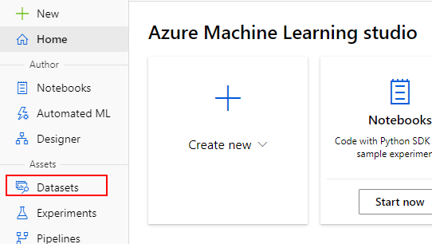
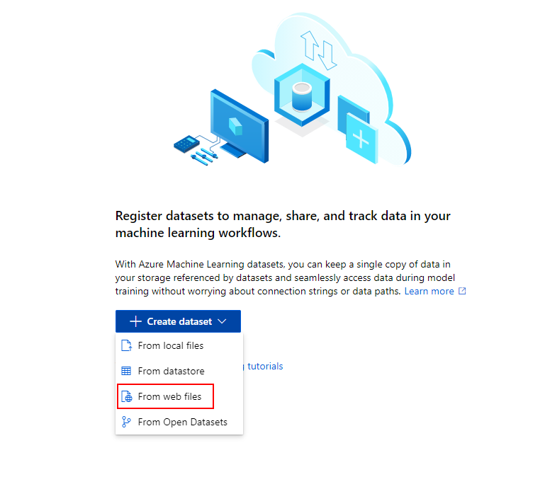
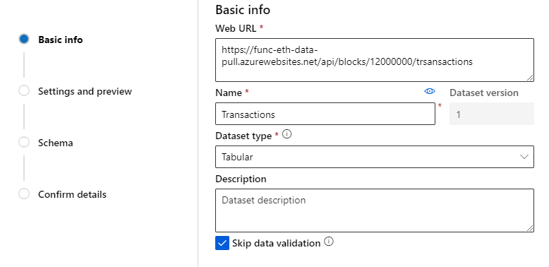
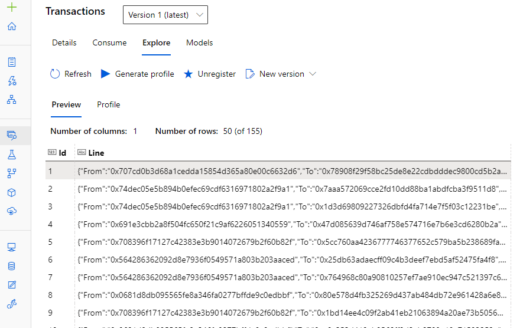

Azure Machine Learning, Microsoft’s managed machine leaning service, has multiple mechanisms to pull data for processing. One of those mechanisms is downloading a file from a remote URL, which we will be using in this article by creating a simple Azure Function that accepts a block number and returns a JSON lines file with a list of the transactions in that block.

### Prerequisites

We will be creating an Azure Function, so [Azure Functions Core Tools](https://docs.microsoft.com/en-us/azure/azure-functions/functions-run-local?tabs=windows%2Ccsharp%2Cbash#install-the-azure-functions-core-tools) should be installed on the workstation. Also, the linked GitHub repository has a Terraform based infrastructure deployment script, so it will require both [Terraform](https://learn.hashicorp.com/terraform/getting-started/install.html) and [Azure CLI](https://docs.microsoft.com/en-us/cli/azure/install-azure-cli?view=azure-cli-latest) installed on the workstation.

### Example Repository

A complete example of the Azure Function and a Terraform script that can be used to deploy the infrastructure required to test the function is available in the following GitHub repository:

> [**GitHub - ItayPodhajcer/azure-func-pull-ethr**](https://github.com/ItayPodhajcer/azure-func-pull-ethr)
> 
> Contribute to ItayPodhajcer/azure-func-pull-ethr development by creating an account on GitHub.

### The Function

We will start by creating a new C# HTTP Trigger based Azure Function called `GetTransactions`\`, using Azure Functions Core Tools’ `func` CLI tool:

Note that the project name is taken from the name of the containing directory.

Next, we will add a reference to `Nethereum`, .Net based library for interacting with Ethereum based networks:

Replace `PROJECT-NAME` with the name of the project you created.

Now we can write the function’s logic, which will include:

-   Accepting a block number as part of the URL route
-   Connecting to Cloudflare’s Ethereum gateway.
-   Retrieving the sent block number’s transactions information.
-   Iterating over the transactions and reading the `from` address, `to` address and the transaction’s value, which is the amount of Ether that was transferred.
-   Encoding the results to JSON lines and sending it as an `application/octet-stream` response (a file).

```csharp
public static class GetTransactions
{
  [FunctionName("GetTransactions")]
  public static async Task<IActionResult> Run(
      [HttpTrigger(AuthorizationLevel.Anonymous, "get", Route = "blocks/{blockNumber}/trsansactions")] HttpRequest req,
      int blockNumber,
      ILogger log)
  {
    var web3 = new Web3("https://cloudflare-eth.com");

    var blockWithTxs = await web3.Eth.Blocks.GetBlockWithTransactionsByNumber.SendRequestAsync(new HexBigInteger(blockNumber));

    var transactions = blockWithTxs.Transactions
      .Where(tx => tx.Value.Value > 0 && tx.Input.Length == 2)      
      .Select(tx => JsonSerializer.Serialize(new 
      {
        From = tx.From,
        To = tx.To,
        Amount = UnitConversion.Convert.FromWei(tx.Value.Value)
      }));

    return new FileContentResult(
      Encoding.Default.GetBytes(string.Join("\n", transactions)), 
      MediaTypeNames.Application.Octet);
  }
}
```

And once we are done writing the code, we can build and publish the function to a local folder:

### Testing the Function

To easiest way to test the function is using the Terraform script included with the example GitHub repository mentioned above, by first logging in to Azure:

And then running the Terraform script:

Once the infrastructure is deployed, we can archive the content of thepublished Azure Function directory (should be /src/bin/Release/netcoreapp3.1/publish) and deploy it to the newly created function app.

Note that if you are using Visual Studio Code you can use tasks that were created as part of the GitHub repository to deploy (and later remove) both the included example function and the infrastructure in one command:

-   `tf-apply`: Builds and publishes the function and then creates the infrastructure and deploy the function.
-   `tf-destroy`: Removes all the infrastructure resources that were created by the `tf-apply` task.

Now we launch the Azure Machine Learning Studio using the “Launch studio” button in the machine learning resource that was created, and go to the “Datasets” screen:



Create a new web files dataset:



With the following basic info:

-   Web URL (will be using block 12,000,000, a nice round number): [`https://func-eth-data-pull.azurewebsites.net/api/blocks/12000000/trsansactions`](https://func-eth-data-pull.azurewebsites.net/api/blocks/12000000/trsansactions)  
    Adjust function URL as to match your environment
-   Name: Transactions
-   Dataset Type: Tabular
-   Check “Skip data validation” as the size of the data might cause the validation to fail



Hit “Next” and then just change the file format to `JOSN Lines` and hit “Next” two more times, and then hit “Create” in the confirmation step.

You now have an entry called “Transactions” in the datasets page, click on it, go to the “Explore” tab, and you should now see the list of transactions for Ethereum block 12,000,000:



### Conclusion

The function in this article filters the data to only Ether transactions, it can be improved to pull much more elaborate data (such as smart contracts events’ data), which in turn can be processed by Azure Machine Learning. The File URL options of the service, practically allows us to create small wrappers for every possible external data source we can think of.
