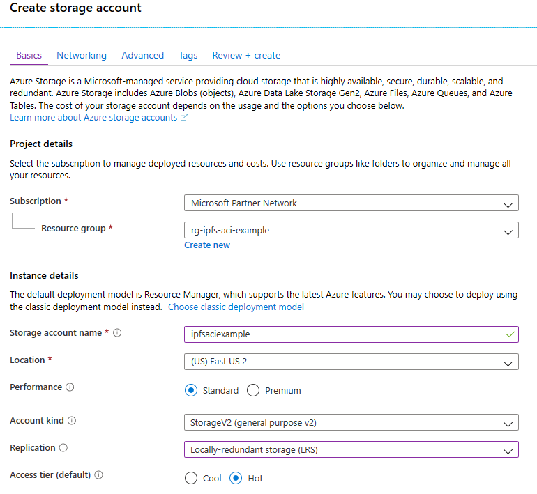
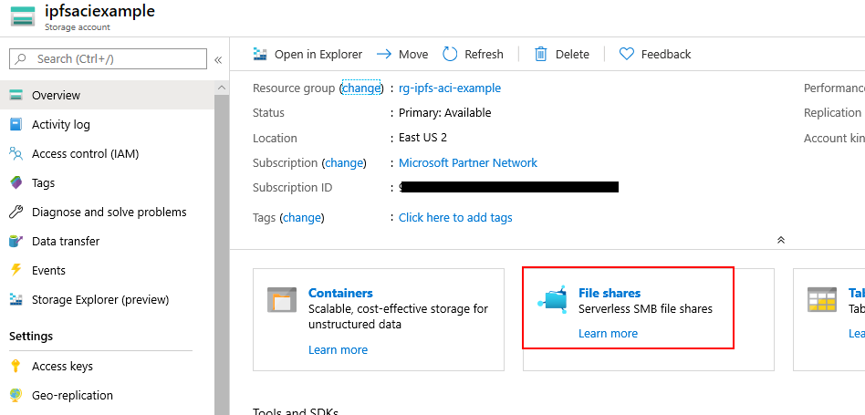
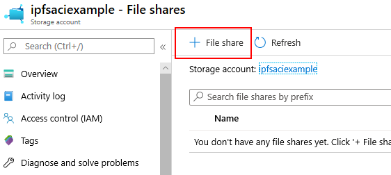
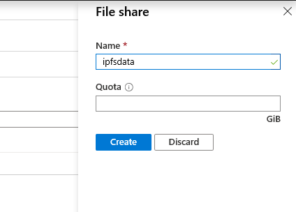
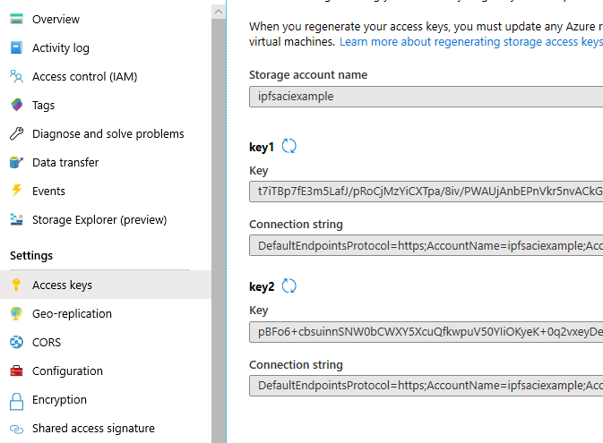
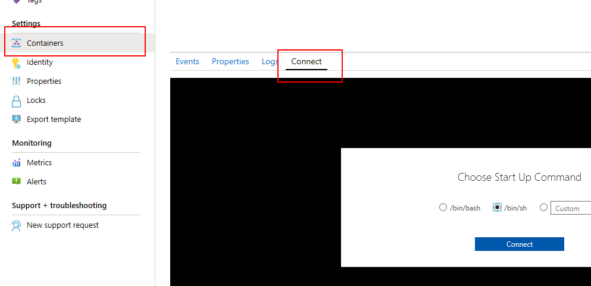
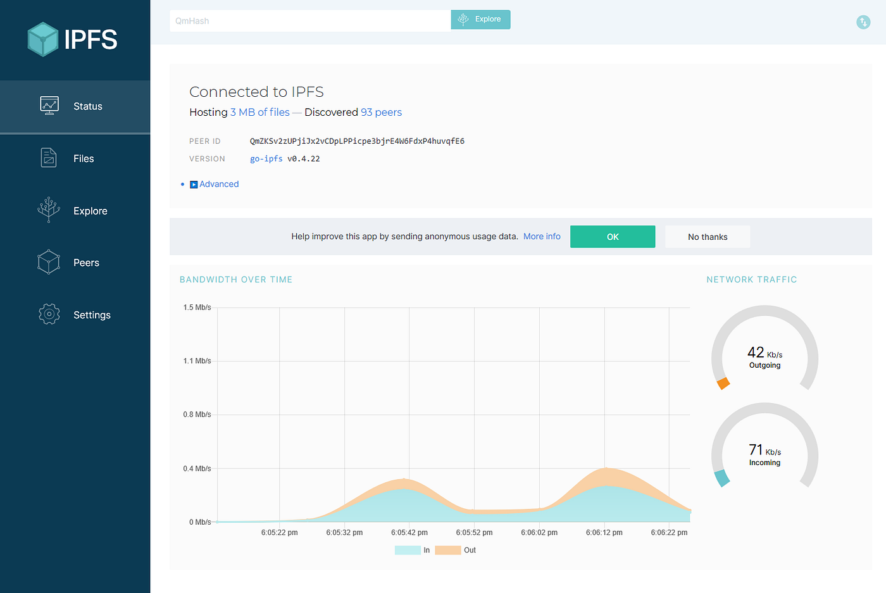

The [InterPlanetary File System (IPFS)](https://ipfs.io/) is a protocol and a network for storing and sharing data using a distributed file system with a global namespace that connects all devices. Files are identified by generating a unique address using their content, which later can be used to request that file from any node in the network.

In this article we will be deploying an IPFS node on Azure using an Azure Container Instances resource to run the `ipfs/go-ipfs` [docker image](https://hub.docker.com/r/ipfs/go-ipfs/) and two storage account file shares to mount as volumes to persist the state of the node.

### Prerequisites

We will be using Azure CLI to deploy the Azure Container Instances resource, so make sure you have it installed on your computer. You can find installation instructions for available platforms in the following page:

> [**Install the Azure CLI**](https://docs.microsoft.com/en-us/cli/azure/install-azure-cli?view=azure-cli-latest)
> 
> The Azure CLI is a command-line tool providing a great experience for managing Azure resources. The CLI is designed to…

### Example Script Repository

As always, this article’s repository can be found here:

> [**GitHub - ItayPodhajcer/ipfs-azure-aci**](https://github.com/ItayPodhajcer/ipfs-azure-aci)
> 
> Contribute to ItayPodhajcer/ipfs-azure-aci development by creating an account on GitHub.

### The Storage Account

It is recommended creating a dedicated resource group for the resources we will be creating, as it will be easier to delete them later.  
We will start by creating the two file shares that will be mounted to the container.

-   Create a new storage account (not need to configure Networking and Advanced for this example):



-   Go to the File shares section once the account is created:



-   Create two file shares, one named “ipfsdata” and one named “ipfsexport”:



No need to set a quota for our example:



-   Go to the Access Keys section and copy one of the keys, we will need it in our deployment script:



### The Container

To deploy the container, we will be using a YAML script, which is one of a few available deployment mechanisms (ARM template is another option for example).

-   We will start by defining the API version, location (Azure region) and resource name:

```yaml
apiVersion: '2018-10-01'
location: 'eastus2'
name: aci-ipfs-example
```

-   Next we will added the container configuration under the properties section:

```yaml
properties:
  containers:
  - name: ipfs
    properties:
      image: ipfs/go-ipfs
      ports:
      - port: 4001
      - port: 5001
      - port: 8080
      resources:
        requests:
          cpu: 1.0
          memoryInGB: 1.5
      volumeMounts:
      - mountPath: /data/ipfs
        name: ipfsdatavolume
      - mountPath: /export
        name: ipfsexportvolume
```

-   Add additional resource properties such as OS, DNS name and public ports:

```yaml
osType: Linux
  restartPolicy: Always
  ipAddress:
    type: Public
    ports:
    - port: 4001
    - port: 5001
    - port: 8080
    dnsNameLabel: ipfs-example
```

-   Add the volumes (make sure you set the storage account key and name):

```yaml
volumes:
  - name: ipfsdatavolume
    azureFile:
      sharename: ipfsdata
      storageAccountName: <Storage account name>
      storageAccountKey: <Storage account key>
  - name: ipfsexportvolume
    azureFile:
      sharename: ipfsexport
      storageAccountName: <Storage account name>
      storageAccountKey: <Storage account key>
```

-   And finally add the resource tags (empty in our example) and type:

```yaml
tags: {}
type: Microsoft.ContainerInstance/containerGroups
```

The complete file should look similar to this:

```yaml
apiVersion: '2018-10-01'
location: 'eastus2'
name: aci-ipfs-example
properties:
  containers:
  - name: ipfs
    properties:
      image: ipfs/go-ipfs
      ports:
      - port: 4001
      - port: 5001
      - port: 8080
      resources:
        requests:
          cpu: 1.0
          memoryInGB: 1.5
      volumeMounts:
      - mountPath: /data/ipfs
        name: ipfsdatavolume
      - mountPath: /export
        name: ipfsexportvolume
  osType: Linux
  restartPolicy: Always
  ipAddress:
    type: Public
    ports:
    - port: 4001
    - port: 5001
    - port: 8080
    dnsNameLabel: ipfs-example
  volumes:
  - name: ipfsdatavolume
    azureFile:
      sharename: ipfsdata
      storageAccountName: <Storage account name>
      storageAccountKey: <Storage account key>
  - name: ipfsexportvolume
    azureFile:
      sharename: ipfsexport
      storageAccountName: <Storage account name>
      storageAccountKey: <Storage account key>
tags: {}
type: Microsoft.ContainerInstance/containerGroups
```

Now we can use Azure CLI to run our script. first we need to login to our subscription:

```powershell
az login
```

A browser will open to complete the authentication. Then we execute the YAML script:

```powershell
az container create --resource-group <RESOURCE-GROUP-NAME> --file <PATH-TO-YAML>
```

### Updating CORS

The last step, required to allow access to IPFS’s API thorough the resource URL, is to update the node’s CORS configuration. We will be doing it by connecting to the container from the resource’s “Containers” section (use `/bin/sh`):



And the run the following commands (make sure you change `<ACI Reousrce Name>` to the value of `name` from the YAML script):

```bash
ipfs config --json API.HTTPHeaders.Access-Control-Allow-Origin '["http://<ACI Reousrce Name>.eastus2.azurecontainer.io:5001", "http://127.0.0.1:5001", "https://webui.ipfs.io"]
```

And:

```bash
ipfs config --json API.HTTPHeaders.Access-Control-Allow-Methods '["PUT", "GET", "POST"]'
```

Now we will need to restart the ACI resource, so the IPFS daemon will load the updated CORS configuration.

### Access The Node

Now you should be able to access the web UI using a URL similar to this (replacing `<ACI Reousrce Name>` with your resource name and `eastus2` if you used a different region):

http://<ACI Reousrce Name>.eastus2.azurecontainer.io:5001/webui

You should see the portal loaded with the status page selected (it might take a few seconds on first load):



### Conclusion

Although this is a fully running node, with state persisted outside of the container, meaning that won’t be lost after restarts, it is still not a production grade deployment. Things you might consider for production are: deployment to a private virtual network with a firewall protecting the resource, backup for the file shares and maybe even an ARM template that executes the complete deployment including the commands used to update the CORS configuration.
