One of Hyperledger Besu’s enterprise features, is it’s ability to allow authentication using JSON Web Tokens (JWT) issued by an external 3rd party. This means we should be able to use Auth0’s authentication and authorization services to generate a token (using a common username and password for example) and pass that token to our Hyperledger Node, after it has been configured to accept tokens signed by our Auth0 issuer.

### POSTMAN Collection

A repository with a POSTMAN collection file containing the requests discussed in the testing section of this article can be found here:

> [**GitHub - ItayPodhajcer/hyperledger-besu-auth0**](https://github.com/ItayPodhajcer/hyperledger-besu-auth0)
> 
> Contribute to ItayPodhajcer/hyperledger-besu-auth0 development by creating an account on GitHub.

### Prerequisites

For our authentication example, in which we will be running a local node and authenticate to a remote Auth0 endpoint, we will be needing:

-   Docker installed on the local machine, you can get it [here](https://www.docker.com/get-started).
-   An Auth0 account (don’t worry, the free tier is more than enough for our example), which you can create [here](https://auth0.com/signup).
-   And POSTMAN that’s available [here](https://www.postman.com/), so we can issue HTTP requests and check that our flow works.

### Auth0 API Configuration

We will start by creating a new API through Auth0’s dashboard:

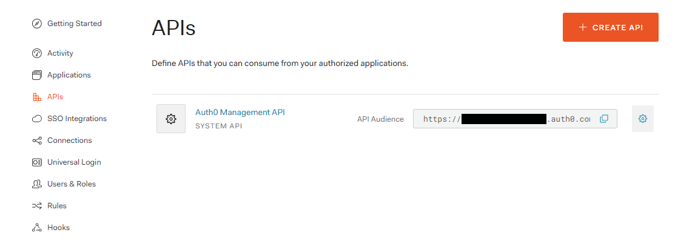

We will call it `Hyperledger Besu` and set its identifier to `https://hyperledger-besu/` (leave the signing algorithm set to `RS256` as that is the algorithm supported by Hyperledger Besu):

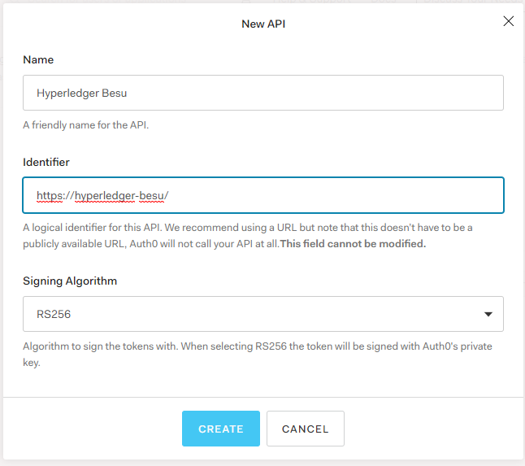

Now that our API is created, we will go to its settings tab and activate Role-Basesd Access Control (RBAC) and add permissions to the access token, as the `permissions` field is required by Hyperledger Besu:

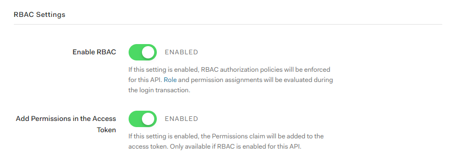

Lastly, we will add a `*:*` permission with a description of **All APIs** in the permissions tab:

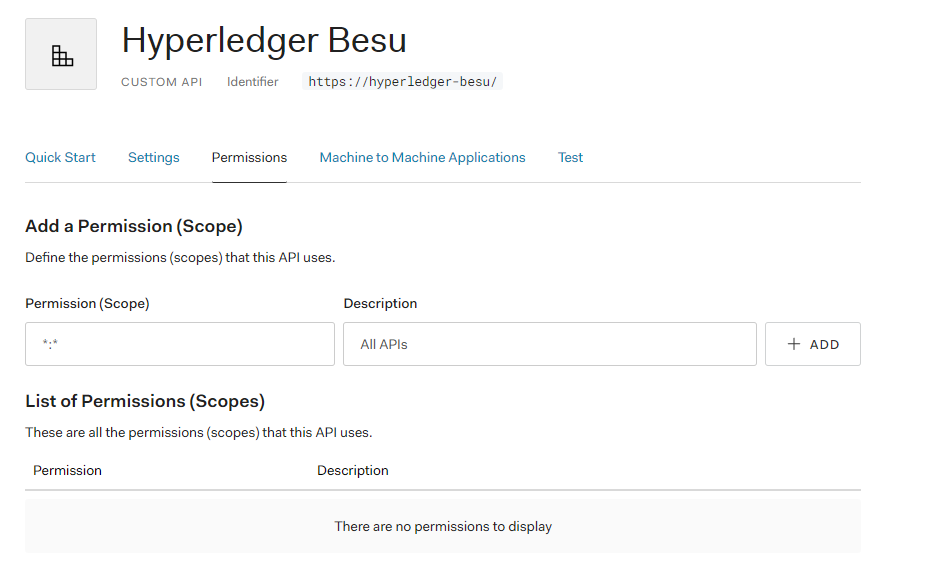

Hyperledger Besu accepts `*:*` to indicate that access is allowed to all APIs, but it can also be restricted to specific groups like so `eth:*` or even to a specific method like so `admin:peers`.

### Auth0 User

We will now create a user for our authentications test:

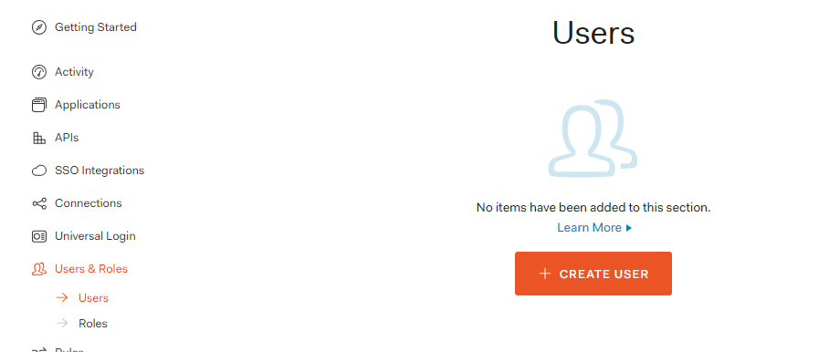

We will set an arbitrary email address for our tests, `test@example.com`, and set the password to something that satisfies the complexity policy such as `!Q@W3e4r`. Leave the connection as is:

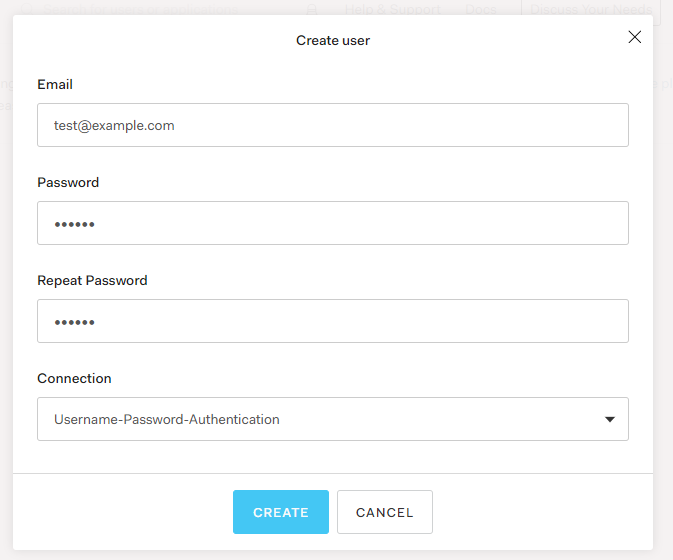

And grant the user the **All APIs** permission of the Hyperledger Besu API we defined earlier through the **Permissions** tab by clicking on **Assign Permissions**, selecting the Hyperledger Besu API, enabling the `*:*` scope and saving by clicking on **Add Permission**:

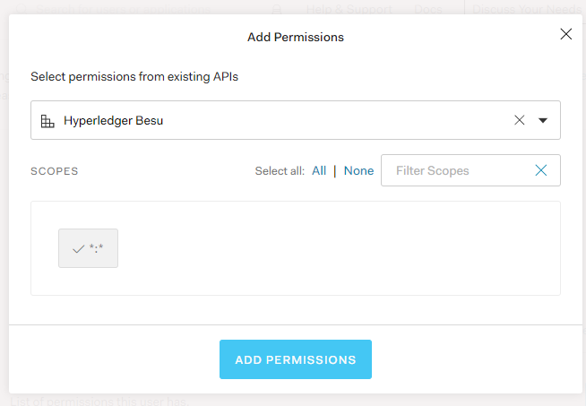

### Auth0 Test Application

You might have noticed when we created our API, that a test application was created as well (if you used the above API name, then its name should be **Hyperledger Besu (Test Application)**). We won’t be using this application, because we need a `native` one to use the `password` flow (you can read more on OAuth flows supported by Auth0 [here](https://auth0.com/docs/flows)), so we will create a new one for testing our flow:

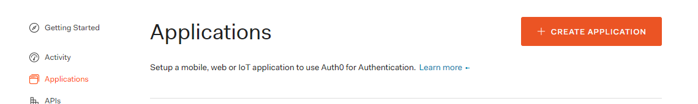

Name it **Example App** and choose **Native**:

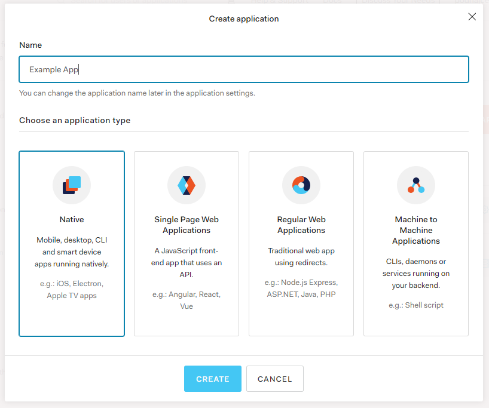

As we will be using the `password` OAuth flow , we will need to allow it in the application through the applications’s advanced settings, shown by clicking on **Show Advanced Settings**, going to the **Grant Types** tab and enabling **Password** (don’t forget to save your changes):

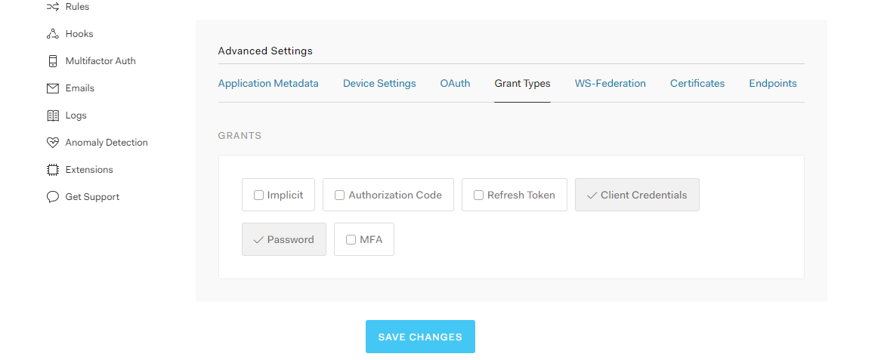

And then download the public key used for signing through the **Certificates** tab (use `PEM` as it is the format used by Hyperledger Besu and just call the file `cert.pem`):

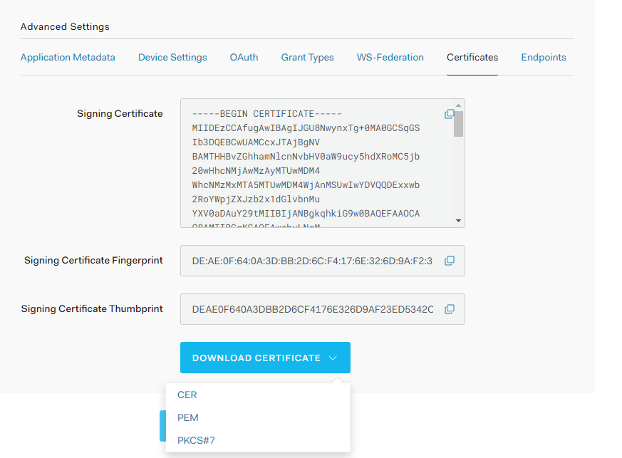

Also, don’t close this page yet, as we will be needing the **Client ID** available here in our POSTMAN requests in the next steps:

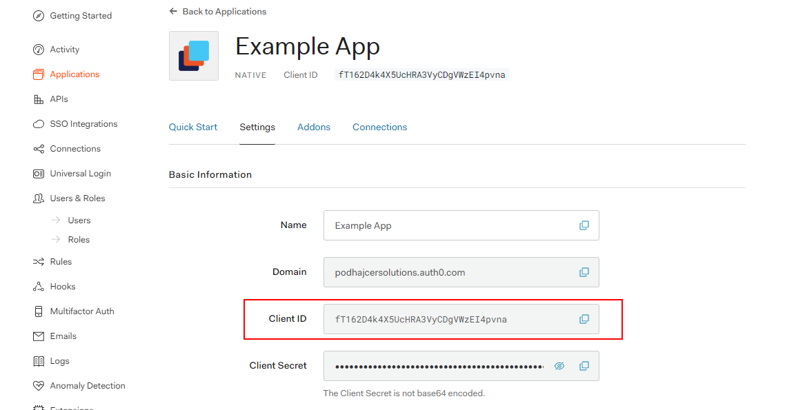

### Auth0 Default Connection

The last step in Auth0’s dashboard, is to set the default connection used for authenticating users (should be `Username-Password-Authentication`, the same value that was available in the **Connection** drop down when we created our test user). To set it, go to your tenant’s settings, **General** tab, **API Authorization Settings** Section and set **Default Directory** to `Username-Password-Authentication`:

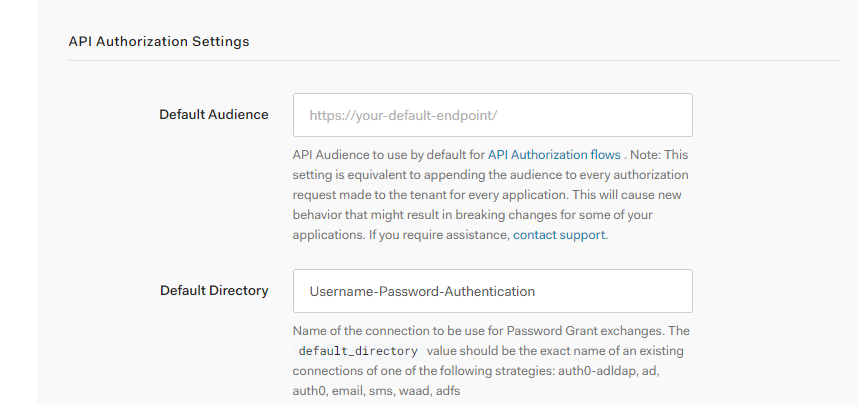

### Public Key File

The easiest way to generate the Public Key file from the certificate file we downloaded earlier is by running the following `openssl` command (in the directory the certificate file is located) in Linux or in the Windows Subsystem for Linux:

```
openssl x509 -pubkey -noout -in cert.pem  > pubkey.pem
```

### Running Hyperledger Besu

To run the Hyperledger Besu node, with JWT authentication enabled and the public key mounted in to the container we will use a command similar to the following (we will only be using the JSON-RPC HTTP endpoint available through port `8545`):

### Testing The Flow

We will define 2 requests in POSTMAN, one for getting a token from Auth0, which will be as follows:  
Method: **POST  
**Headers:   
\- **Content-Type: application/json  
**JSON Body:

Note that the `audience` field is populated by identifier of the Hyperledger Besu API we defined.

Next we will create a request to our Hyperledger Besu node (with a header that contains the `access_token` returned from the first request) which gets the current block number:  
Method: POST  
Headers:  
\- **Content-Type: application/json  
**\- **Authorization: Bearer <ACCESS TOKEN>**  
Body:

Now you can try executing the request both with and without the authorization header. We should see a block number returned when the header is sent and an `Unauthorized` error when when it’s not sent with the request.

### Conclusion

It’s nice to see how Hyperledger Besu can integrate with Auth0, and although in a production scenario we would probably have a more advanced mechanism for returning a given user’s permissions, the hard-coded permission (`*:*`) in our example is enough as proof-of-concept that it can be done.
