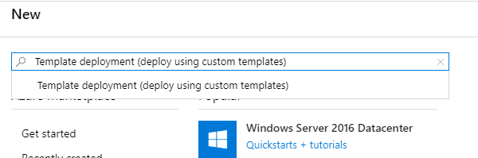
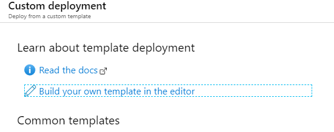
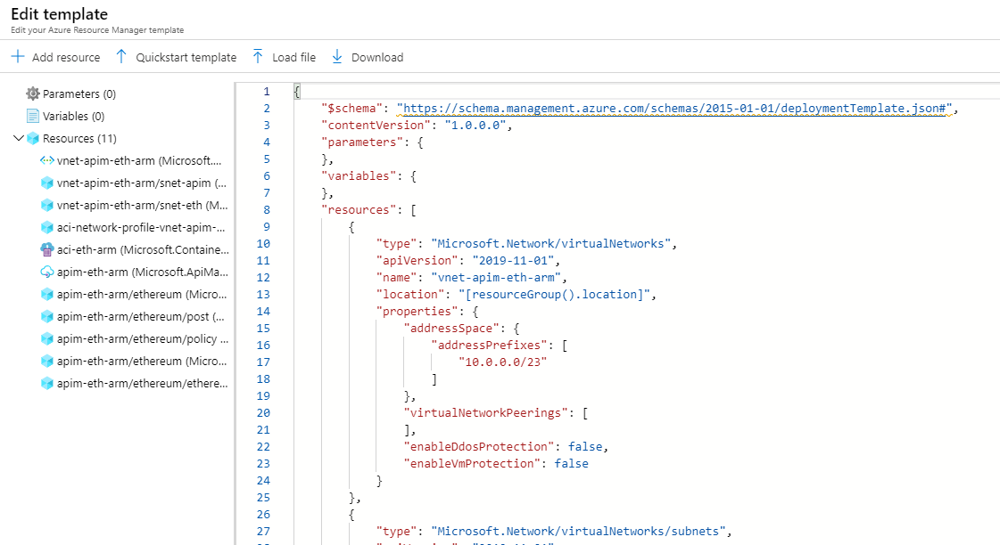
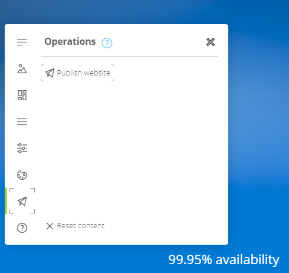
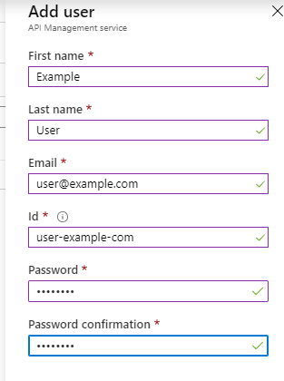
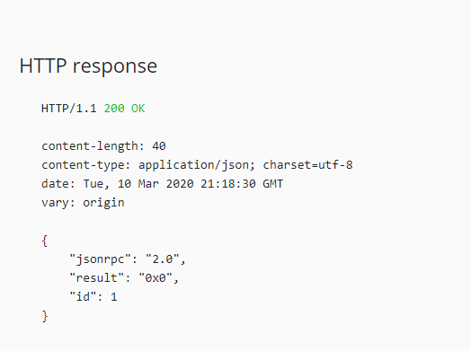

The Parity Ethereum client is not an enterprise targeted implementation, which, when used in scenarios that require limiting access to the node, will need to be placed “behind” a product that acts as a gateway that executes logic to determine whether a connection should be forwarded to the node or not.

Such a product, especially when running on Azure, can be API Management. It allows us to define policies which, for example, lets us:

-   Limit calls by subscription
-   Limit calls by API key
-   Restrict caller IPs
-   Set usage quota by subscription
-   Set usage quota by key
-   And many more

### Template Repository

A repository with a complete Azure Resource Manager template for deploying the complete example, with both a Parity Ethereum node and Azure API Management resource, can be found here:

> [**GitHub - ItayPodhajcer/parity-api-management**](https://github.com/ItayPodhajcer/parity-api-management)
> 
> Contribute to ItayPodhajcer/parity-api-management development by creating an account on GitHub.

### The ARM Template

This time we will be creating an Azure Resource Manager template that will deploy:

-   A virtual network
-   A subnet for the Parity Ethereum node (as we don’t want to expose it directly to the internet)
-   A subnet for the API Management resource
-   An Azure Container Instances resource that will execute the Parity container
-   And lastly, an Azure API Management resource

It is recommended that we create a dedicated resource group for our example which we will use to execute the ARM template we will be writing in the following steps.

We will start by defining the `$schema`, `contentVersio`, empty `parameters` and `variables` sections and the beginning of the `resources` section:

```json
{
    "$schema": "https://schema.management.azure.com/schemas/2015-01-01/deploymentTemplate.json#",
    "contentVersion": "1.0.0.0",
    "parameters": {
    },
    "variables": {
    },
    "resources": [
```

Now we will add the first resource, the virtual network with two subnets. we will use the `10.0.0.0/23` address space for the virtual network, `10.0.0.0/29` for the Parity subnet and `10.0.1.0/29` for the API Management subnet:

```json
{
    "type": "Microsoft.Network/virtualNetworks",
    "apiVersion": "2019-11-01",
    "name": "vnet-apim-eth-arm",
    "location": "[resourceGroup().location]",
    "properties": {
        "addressSpace": {
            "addressPrefixes": [
                "10.0.0.0/23"
            ]
        },
        "virtualNetworkPeerings": [
        ],
        "enableDdosProtection": false,
        "enableVmProtection": false
    }
},
{
    "type": "Microsoft.Network/virtualNetworks/subnets",
    "apiVersion": "2019-11-01",
    "name": "vnet-apim-eth-arm/snet-apim",
    "dependsOn": [
        "[resourceId('Microsoft.Network/virtualNetworks', 'vnet-apim-eth-arm')]"
    ],
    "properties": {
        "addressPrefix": "10.0.1.0/29",
        "delegations": [
        ],
        "privateEndpointNetworkPolicies": "Enabled",
        "privateLinkServiceNetworkPolicies": "Enabled"
    }
},
{
    "type": "Microsoft.Network/virtualNetworks/subnets",
    "apiVersion": "2019-11-01",
    "name": "vnet-apim-eth-arm/snet-eth",
    "dependsOn": [
        "[resourceId('Microsoft.Network/virtualNetworks', 'vnet-apim-eth-arm')]",
        "[resourceId('Microsoft.Network/virtualNetworks/subnets', 'vnet-apim-eth-arm', 'snet-apim')]"
    ],
    "properties": {
        "addressPrefix": "10.0.0.0/29",
        "delegations": [
            {
                "name": "Microsoft.ContainerInstance/containerGroups",
                "properties": {
                    "serviceName": "Microsoft.ContainerInstance/containerGroups"
                }
            }
        ],
        "privateEndpointNetworkPolicies": "Enabled",
        "privateLinkServiceNetworkPolicies": "Enabled"
    }
},
```

Note the delegation defined in the `snet-eth` subnet, that, combined with the following network profile, enable an Azure Container Instances resource to be placed in a private virtual network:

```json
{
    "type": "Microsoft.Network/networkProfiles",
    "apiVersion": "2019-11-01",
    "name": "aci-network-profile-vnet-apim-eth-arm-snet-eth",
    "location": "[resourceGroup().location]",
    "dependsOn": [
        "[resourceId('Microsoft.Network/virtualNetworks/subnets', 'vnet-apim-eth-arm', 'snet-eth')]"
    ],
    "properties": {
        "containerNetworkInterfaceConfigurations": [
            {
                "name": "eth0",
                "properties": {
                    "ipConfigurations": [
                        {
                            "name": "ipconfigprofile",
                            "properties": {
                                "subnet": {
                                    "id": "[resourceId('Microsoft.Network/virtualNetworks/subnets', 'vnet-apim-eth-arm', 'snet-eth')]"
                                }
                            }
                        }
                    ]
                }
            }
        ]
    }
},
```

Now we can create our Container Instances resource, which will execute a single container, `parity/parity`, enabling the HTTP JSON-RPC endpoint and allowing all CORS origins. We will also assign a private IP that will be later used by the API Management resource to communicate with the container:

```json
{
    "type": "Microsoft.ContainerInstance/containerGroups",
    "apiVersion": "2018-10-01",
    "name": "aci-eth-arm",
    "location": "[resourceGroup().location]",
    "dependsOn": [
        "[resourceId('Microsoft.Network/networkProfiles', 'aci-network-profile-vnet-apim-eth-arm-snet-eth')]"
    ],
    "properties": {
        "containers": [
            {
                "name": "aci-eth-arm",
                "properties": {
                    "image": "parity/parity",
                    "resources": {
                        "requests": {
                            "cpu": 1,
                            "memoryInGb": 1.5
                        }
                    },
                    "command": [
                        "parity",
                        "--jsonrpc-interface=0.0.0.0",
                        "--jsonrpc-cors",
                        "all"
                    ],
                    "ports": [
                        {
                            "protocol": "TCP",
                            "port": 8545
                        }
                    ]
                }
            }
        ],
        "restartPolicy": "Always",
        "ipAddress": {
            "ports": [
                {
                    "protocol": "TCP",
                    "port": 8545
                }
            ],
            "ip": "10.0.0.4",
            "type": "Private"
        },
        "osType": "Linux",
        "networkProfile": {
            "id": "[resourceId('Microsoft.Network/networkProfiles', 'aci-network-profile-vnet-apim-eth-arm-snet-eth')]"
        }
    }
},
```

And the last remaining resource, the API Management, which will create using the `developer` SKU, which is enough for our example, and add to it:

-   API that points to the container with the address we defined earlier.
-   a single `POST` operation which will cover our possible calls to the Parity Ethereum node.
-   A policy that will limit the calls rate to 1 every 60 seconds by key and allow all CORS origins (note that this XML value needs to be JSON escaped, it can be done with a tool like [this](https://www.freeformatter.com/json-escape.html)):

```xml
<policies>
  <inbound>
    <base />
    <rate-limit-by-key calls="1" renewal-period="60" counter-key="@(context.Subscription?.Key ?? &quot;anonymous&quot;)" />
    <cors>
      <allowed-origins>
        <origin>*</origin>
      </allowed-origins>
      <allowed-methods>
        <method>POST</method>
      </allowed-methods>
      <allowed-headers>
        <header>*</header>
      </allowed-headers>
      <expose-headers>
        <header>*</header>
      </expose-headers>
    </cors>
  </inbound>
  <backend>
    <base />
  </backend>
  <outbound>
    <base />
  </outbound>
  <on-error>
    <base />
  </on-error>
</policies>
```

-   And product to which the API will be associated and developers can get subscriptions to.

```json
{
    "type": "Microsoft.ApiManagement/service",
    "apiVersion": "2019-01-01",
    "name": "apim-eth-arm",
    "location": "East US 2",
    "dependsOn": [
        "[resourceId('Microsoft.Network/virtualNetworks/subnets', 'vnet-apim-eth-arm', 'snet-apim')]"
    ],
    "sku": {
        "name": "Developer",
        "capacity": 1
    },
    "properties": {
        "publisherEmail": "administrator@example.com",
        "publisherName": "Example",
        "virtualNetworkConfiguration": {
            "subnetResourceId": "[resourceId('Microsoft.Network/virtualNetworks/subnets', 'vnet-apim-eth-arm', 'snet-apim')]"
        },
        "virtualNetworkType": "External"
    }
},
{
    "type": "Microsoft.ApiManagement/service/apis",
    "apiVersion": "2019-01-01",
    "name": "apim-eth-arm/ethereum",
    "dependsOn": [
        "[resourceId('Microsoft.ApiManagement/service', 'apim-eth-arm')]"
    ],
    "properties": {
        "displayName": "Ethereum",
        "apiRevision": "1",
        "subscriptionRequired": true,
        "serviceUrl": "http://10.0.0.4:8545",
        "protocols": [
            "https"
        ],
        "isCurrent": true,
        "path": ""
    }
},
{
    "type": "Microsoft.ApiManagement/service/apis/operations",
    "apiVersion": "2019-01-01",
    "name": "apim-eth-arm/ethereum/post",
    "dependsOn": [
        "[resourceId('Microsoft.ApiManagement/service/apis', 'apim-eth-arm', 'ethereum')]",
        "[resourceId('Microsoft.ApiManagement/service', 'apim-eth-arm')]"
    ],
    "properties": {
        "displayName": "POST",
        "method": "POST",
        "urlTemplate": "/",
        "templateParameters": [
        ],
        "request": {
            "queryParameters": [
            ],
            "headers": [
                {
                    "name": "Content-Type",
                    "type": "string",
                    "required": true,
                    "values": [
                        "application/json"
                    ]
                }
            ],
            "representations": [
            ]
        },
        "responses": [
        ]
    }
},
{
    "type": "Microsoft.ApiManagement/service/apis/policies",
    "apiVersion": "2019-01-01",
    "name": "apim-eth-arm/ethereum/policy",
    "dependsOn": [
        "[resourceId('Microsoft.ApiManagement/service/apis', 'apim-eth-arm', 'ethereum')]",
        "[resourceId('Microsoft.ApiManagement/service', 'apim-eth-arm')]"
    ],
    "properties": {
        "value": "<policies>\r\n  <inbound>\r\n    <base />\r\n    <rate-limit-by-key calls=\"1\" renewal-period=\"60\" counter-key=\"@(context.Subscription?.Key ?? &quot;anonymous&quot;)\" />\r\n    <cors>\r\n      <allowed-origins>\r\n        <origin>*</origin>\r\n      </allowed-origins>\r\n      <allowed-methods>\r\n        <method>POST</method>\r\n      </allowed-methods>\r\n      <allowed-headers>\r\n        <header>*</header>\r\n      </allowed-headers>\r\n      <expose-headers>\r\n        <header>*</header>\r\n      </expose-headers>\r\n    </cors>\r\n  </inbound>\r\n  <backend>\r\n    <base />\r\n  </backend>\r\n  <outbound>\r\n    <base />\r\n  </outbound>\r\n  <on-error>\r\n    <base />\r\n  </on-error>\r\n</policies>",
        "format": "xml"
    }
},
{
    "type": "Microsoft.ApiManagement/service/products",
    "apiVersion": "2019-01-01",
    "name": "apim-eth-arm/ethereum",
    "dependsOn": [
        "[resourceId('Microsoft.ApiManagement/service', 'apim-eth-arm')]"
    ],
    "properties": {
        "displayName": "Ethereum",
        "description": "Ethereum product",
        "subscriptionRequired": true,
        "approvalRequired": false,
        "subscriptionsLimit": 1,
        "state": "published"
    }
},
{
    "name": "apim-eth-arm/ethereum/ethereum",
    "type": "Microsoft.ApiManagement/service/products/apis",
    "apiVersion": "2019-01-01",
    "properties": {},
    "dependsOn": [
        "[resourceId('Microsoft.ApiManagement/service/apis', 'apim-eth-arm', 'ethereum')]",
        "[resourceId('Microsoft.ApiManagement/service/products', 'apim-eth-arm', 'ethereum')]",
        "[resourceId('Microsoft.ApiManagement/service', 'apim-eth-arm')]"
    ]
},
{
    "name": "apim-eth-arm/ethereum/developers",
    "type": "Microsoft.ApiManagement/service/products/groups",
    "apiVersion": "2019-01-01",
    "properties": {},
    "dependsOn": [
        "[resourceId('Microsoft.ApiManagement/service/products/apis', 'apim-eth-arm', 'ethereum', 'ethereum')]"
    ]
}
```

You can find an example of how the complete template should look like in the above linked GitHub repository.

### Running The Template

To run the template we just create, we will be using Azure’s portal this time, a new **Template deployment** resource needs to be create inside a resource group:



After we hit **Create**, we will need to choose **Build your own template in editor**:



Load our template file (after the file is loaded the editor should look like the following):



Click on **Save** and on the next screen (the values should already be populated as we added the template in an existing resource) agree to the terms and then click on **Purchase** (as we are purchasing the resources defined by the template).

The template might take a relatively long period to deploy (API Management is a large resource even using the `developer` SKU) and once completed, we should have 3 resources in our resource group:

-   A virtual network.
-   An Azure Container Instances resource.
-   And an Azure API Management resource.

### API Management Setup

To complete the setup of our example, we will be:

-   Publish the API Management portal.
-   Create a user to test our API.

To publish the developer portal, when inside the API Management resource, click on **Developer portal**:


It might take a few seconds to load. Once loaded, click on **Publish-website** located under **Operations** (the icon of the paper air plane):



Next, back at the API Resource, we will now create a user for testing our example. Under **Users**, click on **Add** and set values for **First name**, **Last name**, **Email** and **Password** like `1234567` (No need to enter an Id as it is generated when an email address is entered):



### Testing

Now that we have everything setup, we can test our API using API Management’s Developer portal (the URL is available in the resource’s **Overview** tab):

-   Browse to the Developer portal.
-   Sign in using the user we created.
-   Once signed in, click on **Products.**
-   Click on the **Ethereum** product.
-   Enter a subscription name and Click on **Subscribe**.

On the page that is displayed after the subscription is created, click on **Show** on either of the keys (Primary or Secondary, it doesn’t matter for our example) and copy the value.

Now we can test the **Ethereum** API using the users API key:

-   Click on **APIs** in the portal’s menu.
-   Click on the **Ethereum** API.
-   Once the page loads, click on the green **Try it** button.
-   `Content-Type` should be set to `application/json`.
-   The API key should be placed in the `Ocp-Apim-Subscription-Key` header.
-   And the body should be set to a value which will be accepted by the Parity Ethereum node, such as:

-   And then click on **Send**.

If everything worked as expected, we should see a result similar to this:



Now, if we try to hit **Send** again, before 60 seconds have passed (as we defined in our policy), the operation will fail and although the message in the browser seems related to CORS, if checked was actually returned by the server (such as using the browsers developers tools), we should see the following response:

That’s it, we create a Parity Ethereum node inside a private virtual network with Azure API Management as its rate limiting gateway.

### Cleanup

As the container located in the virtual network required a network profile, which at the writing of this article, wasn’t possible to delete using the portal, we will need to follow this steps:

-   Delete the API Management resource.
-   Delete the Container Instances resource.
-   Run the following in the command line:

-   And lastly, delete the virtual network.

### Conclusion

Although everything seems to work pretty well with the resources deployed in this example, a production grade deployment will require much more, such as: higher SKU for the API Management resource, additional deployments of Parity Ethereum nodes, maybe even in multiple regions.
