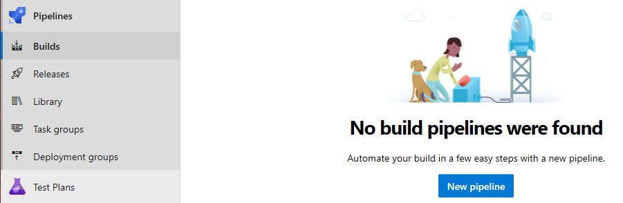
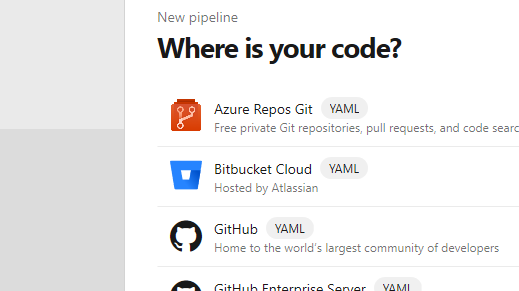
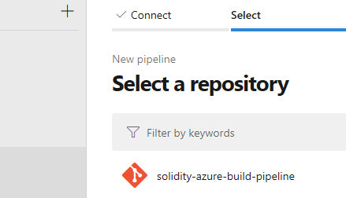
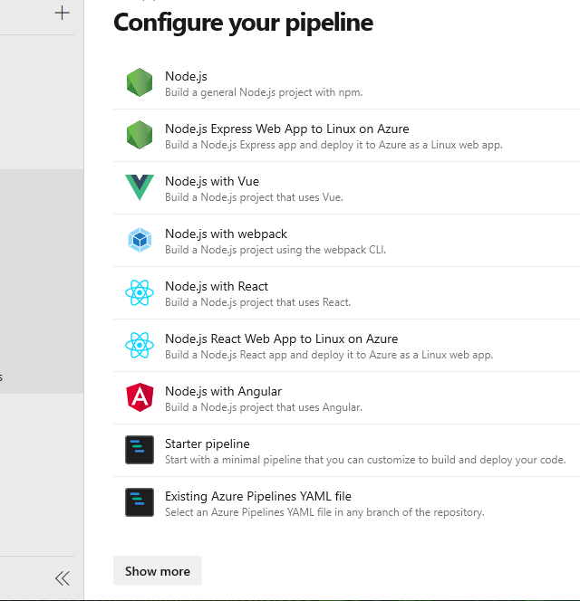
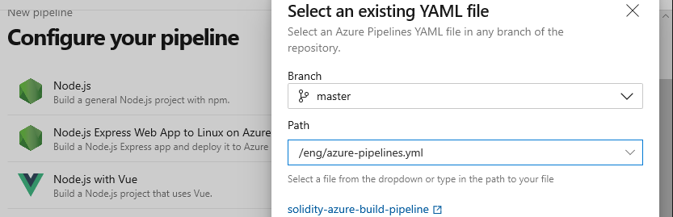
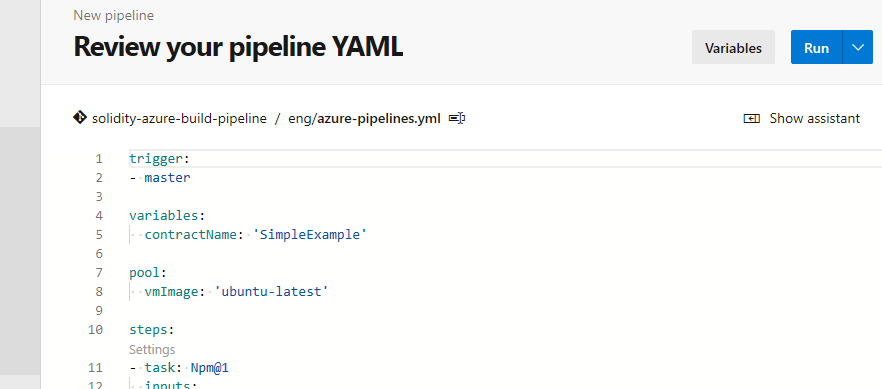
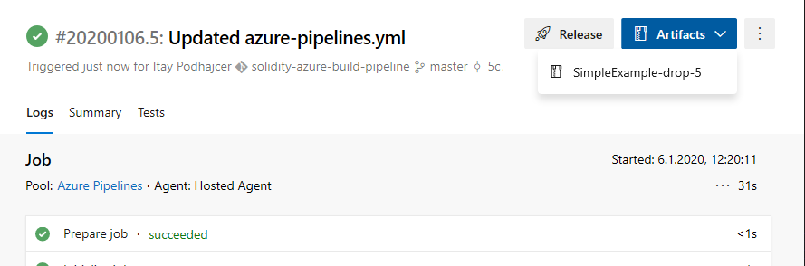
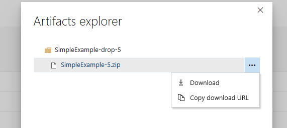

In real world scenarios, a developer usually doesn’t deploy a software component to a production environment straight from his local workstation. Usually, there a well defined automated process that is triggered when the developer checks in his code (to whichever source control platform is being used).

In this article we’ll be using an Azure DevOps build pipeline (with either a connection to an external Git repository or a local Azure DevOps Git repository, your choice) to build a solidity contract when a check-in is made to the `master` branch.

### TL;DR

A GitHub repository with the complete example is available here:

> [**GitHub - ItayPodhajcer/solidity-azure-build-pipeline**](https://github.com/ItayPodhajcer/solidity-azure-build-pipeline)
> 
> Contribute to ItayPodhajcer/solidity-azure-build-pipeline development by creating an account on GitHub.

You can grab it, push it to your own repository and configure a pipeline with the `azure-pipelines.yml` file included under the `eng` folder.

### Prerequisites

To complete the all the steps described in this article, including the ones for writing the basic `solidity` smart contract you’ll need to install the following:

-   **npm**: You can find instructions on installing it [here](https://www.npmjs.com/get-npm).
-   **truffle**: You can find instructions on installing it through `npm` [here](https://www.trufflesuite.com/docs/truffle/getting-started/installation).

### Creating a Simple Contract

Once all the tools are installed, create a root folder with whatever name you want and when done, run `npm init` and just continue with the default values when asked by the initialization process.

To make it a little bit more interesting, we will base our contract on one of [OpenZepplin](https://openzeppelin.com/)’s open source ERC [contracts](https://openzeppelin.com/contracts/), so will need to install their contracts package locally by typing `npm install @openzeppelin/contracts` .

Now create an `src` folder, enter it and type `truffle init`. This will create the basic `truffle` smart contract project. Once complete, create a new smart contract called `SimpleExample` by typing `truffle create contract SimpleExample`.

Under the `contracts` folder you will now find the newly created `solidity` file `SimpleExample.sol`. We will create a contract that imports OpenZepplin’s `ERC20` and `ERC20Detialed`, name it “Simple Example” with a symbol of “SE” and 2 decimal points. The final file should look similar to this:

```solidity
pragma solidity ^0.5.0;
import "@openzeppelin/contracts/token/ERC20/ERC20.sol";
import "@openzeppelin/contracts/token/ERC20/ERC20Detailed.sol";
contract SimpleExample is ERC20, ERC20Detailed {
	constructor() ERC20Detailed("Simple Example", "SE", 2) public {
	}
}
```

Now just run `truffle compile` in the `src` folder to make sure the contract’s code is OK.

### The Build Pipeline

The purpose of the pipeline will be to take the contract’s source code, compile it and create an archive file with the result. The complete list of steps are as follows:  
1\. npm install  
2\. truffle compile  
3\. archive compilation result  
4\. publish contract archive

First we will create an new `eng` folder under our root folder and create an empty `azure-pipelines.yml` file in it.  
Once create, we will start our script by defining a trigger that listens to check-ins in the `master` branch:

```yaml
trigger:
- master
```

Next, we will create a variable for the contract name, so we don’t need to write the name in all places, but use a variable that can be easily changed:

```yaml
variables:
  contractName: 'SimpleExample'
```

Then we will define the image we want to use for our build pipeline:

```yaml
pool:
  vmImage: 'ubuntu-latest'
```

Now we will add our steps, the fist being `npm install`:

```yaml
steps:
- task: Npm@1
  inputs:
    command: 'install'
  displayName: npm install
```

Then we will execute truffle by using `npm`'s package execution tool, `npx`, inside the `src` folder:

```yaml
- script: |
    cd src
    npx truffle compile contracts/$(contractName).sol
  displayName: truffle compile $(contractName)
```

After the completion, we archive the result `json` file:

```yaml
- task: ArchiveFiles@2
  inputs:
    rootFolderOrFile: '$(System.DefaultWorkingDirectory)/src/build/contracts/$(contractName).json'
    includeRootFolder: false
    archiveType: 'zip'
    archiveFile: '$(Build.ArtifactStagingDirectory)/$(contractName)-$(Build.BuildId).zip'
  displayName: archive contract $(contractName)
```

And finally, we publish the archive as an artifact of the pipeline:

```yaml
- task: PublishBuildArtifacts@1
  inputs:
    PathtoPublish: '$(Build.ArtifactStagingDirectory)/$(contractName)-$(Build.BuildId).zip'
    ArtifactName: $(contractName)-drop-$(Build.BuildId)
  displayName: publish contract $(contractName)
```

### Configuring The Pipeline

Once all the code is complete and stored in our source control repository (Azure DevOps Git for the purpose of this article), we will configure the pipeline through the Azure DevOps portal.

We will start by going to **Pipelines / Builds** and clicking on **New Pipeline**:



Next we will choose **Azure Repos Git**:



Select the repository we are going to use:



Choose **Existing Azure Pipelines YAML file** as we already wrote it previously:



Choose our `azure-pipelines.yml` file (it should be available in the `Path` dropdown) and click on **Continue**:



Review the `YAML` file we selected and `Run` it:



Once the pipeline execution complete successfully, you will be able to download the artifact:



By selecting the `zip` file artifact we published:



Notice the `5` in the file name, this is due to our definition in the script to append the `BuildId` to the file name, so it could easier to distinguish between different versions of the compiled contract.

### Conclusion

This pipeline can be improved even further with additional tasks that might be relevant in a smart contract’s lifecycle, such as testing the contract before archiving it and failing the pipeline if the tests fail.
